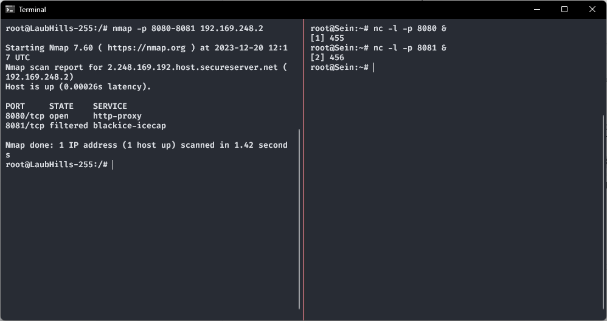

<div align=center>

# Dokumentasi Jarkom Praktikum 4

| Nama | Muhammad Ersya Vinorian |
| :--- | :---------------------- |
| NRP  | 5025211045              |

</div>

# Prerequisites

## A. Topologi


## B. Perhitungan IP VLSM

### Tree


### Pembagian IP

| Nama Subnet | Jumlah IP | Netmask | IP Subnet       | Mask            | Broadcast Address |
| :---------: | --------: | :-----: | :-------------- | :-------------- | :---------------- |
|     A1      |         2 |   /30   | 192.169.254.128 | 255.255.255.252 | 192.169.254.131   |
|     A2      |         2 |   /30   | 192.169.254.132 | 255.255.255.252 | 192.169.254.135   |
|     A3      |       514 |   /22   | 192.169.248.0   | 255.255.252.0   | 192.169.251.255   |
|     A4      |      1023 |   /21   | 192.169.240.0   | 255.255.248.0   | 192.169.247.255   |
|     A5      |         2 |   /30   | 192.169.254.136 | 255.255.255.252 | 192.169.254.139   |
|     A6      |         2 |   /30   | 192.169.254.140 | 255.255.255.252 | 192.169.254.143   |
|     A7      |        66 |   /25   | 192.169.254.0   | 255.255.255.128 | 192.169.254.127   |
|     A8      |       256 |   /23   | 192.169.252.0   | 255.255.254.0   | 192.169.253.255   |
|     A9      |         2 |   /30   | 192.169.254.144 | 255.255.255.252 | 192.169.254.147   |
|     A10     |         2 |   /30   | 192.169.254.148 | 255.255.255.252 | 192.169.254.151   |

## C. Subnetting dan Routing

### Aura

```sh
auto eth0
iface eth0 inet dhcp

# to A1
auto eth1
iface eth1 inet static
	address 192.169.254.129
	netmask 255.255.255.252

# to A2
auto eth2
iface eth2 inet static
	address 192.169.254.133
	netmask 255.255.255.252

# via A1
up route add -net 192.169.248.0 netmask 255.255.252.0 gw 192.169.254.130 # A3
up route add -net 192.169.240.0 netmask 255.255.248.0 gw 192.169.254.130 # A4

# via A2
up route add -net 192.169.254.136 netmask 255.255.255.252 gw 192.169.254.134 # A5
up route add -net 192.169.254.140 netmask 255.255.255.252 gw 192.169.254.134 # A6
up route add -net 192.169.254.0   netmask 255.255.255.128 gw 192.169.254.134 # A7
up route add -net 192.169.252.0   netmask 255.255.254.0   gw 192.169.254.134 # A8
up route add -net 192.169.254.144 netmask 255.255.255.252 gw 192.169.254.134 # A9
up route add -net 192.169.254.148 netmask 255.255.255.252 gw 192.169.254.134 # A10
```

### Heiter

```sh
# from A1
auto eth0
iface eth0 inet static
	address 192.169.254.130
	netmask 255.255.255.252
	gateway 192.169.254.129

# to A3
auto eth1
iface eth1 inet static
	address 192.169.248.1
	netmask 255.255.252.0

# to A4
auto eth2
iface eth2 inet static
	address 192.169.240.1
	netmask 255.255.248.0
```

### Sein

```sh
# from A3
auto eth0
iface eth0 inet static
	address 192.169.248.2
	netmask 255.255.252.0
	gateway 192.169.248.1
```

### GrobeForest

```sh
auto eth0
iface eth0 inet dhcp
```

### TurkRegion

```sh
auto eth0
iface eth0 inet dhcp
```

### Frieren

```sh
# from A2
auto eth0
iface eth0 inet static
	address 192.169.254.134
	netmask 255.255.255.252
	gateway 192.169.254.133

# to A5
auto eth1
iface eth1 inet static
	address 192.169.254.137
	netmask 255.255.255.252

# to A6
auto eth2
iface eth2 inet static
	address 192.169.254.141
	netmask 255.255.255.252

# via A5
up route add -net 192.169.254.0   netmask 255.255.255.128 gw 192.169.254.138 # A7
up route add -net 192.169.252.0   netmask 255.255.254.0   gw 192.169.254.138 # A8
up route add -net 192.169.254.144 netmask 255.255.255.252 gw 192.169.254.138 # A9
up route add -net 192.169.254.148 netmask 255.255.255.252 gw 192.169.254.138 # A10
```

### Stark

```sh
# from A6
auto eth0
iface eth0 inet static
	address 192.169.254.142
	netmask 255.255.255.252
	gateway 192.169.254.141
```

### Himmel

```sh
# from A5
auto eth0
iface eth0 inet static
	address 192.169.254.138
	netmask 255.255.255.252
	gateway 192.169.254.137

# to A7
auto eth1
iface eth1 inet static
	address 192.169.254.1
	netmask 255.255.255.128

# to A8
auto eth2
iface eth2 inet static
	address 192.169.252.1
	netmask 255.255.254.0

# via A7
up route add -net 192.169.254.144 netmask 255.255.255.252 gw 192.169.254.2 # A9
up route add -net 192.169.254.148 netmask 255.255.255.252 gw 192.169.254.2 # A10
```

### LaubHills

```sh
auto eth0
iface eth0 inet dhcp
```

### SchwerMountain

```sh
auto eth0
iface eth0 inet dhcp
```

### Fern

```sh
# from A7
auto eth0
iface eth0 inet static
	address 192.169.254.2
	netmask 255.255.255.128
	gateway 192.169.254.1

# to A9
auto eth1
iface eth1 inet static
	address 192.169.254.145
	netmask 255.255.255.252

# to A10
auto eth2
iface eth2 inet static
	address 192.169.254.149
	netmask 255.255.255.252
```

### Richter

```sh
# from A9
auto eth0
iface eth0 inet static
	address 192.169.254.146
	netmask 255.255.255.252
	gateway 192.169.254.145
```

### Revolte

```sh
# from A10
auto eth0
iface eth0 inet static
	address 192.169.254.150
	netmask 255.255.255.252
	gateway 192.169.254.149
```

## D. Membuat IP Dinamis Pada Node Client

### Setup DNS Server di Richter

#### Membuat konfigurasi bind9

````bind
; /etc/bind/praktikum/praktikum.a01.com
$TTL    604800
@       IN      SOA     praktikum.a01.com. root.praktikum.a01.com. (
                              1         ; Serial
                         604800         ; Refresh
                          86400         ; Retry
                        2419200         ; Expire
                         604800 )       ; Negative Cache TTL
;
@       IN      NS      praktikum.a01.com.
@       IN      A       192.169.248.2```
````

```apache
# /etc/bind/named.conf.local
zone "praktikum.a01.com" {
        type master;
        file "/etc/bind/praktikum/praktikum.a01.com";
};
```

#### Mengubah opsi bind9

```nginx
options {
        directory "/var/cache/bind";

        forwarders {
                192.168.122.1;
        };

        allow-query { any; };

        auth-nxdomain no;
        listen-on-v6 { any; };
};
```

### Setup DHCP Server di Revolte

```sh
# /etc/default/isc-dhcp-server
INTERFACESv4="eth0"
INTERFACESv6=""
```

```apache
# /etc/dhcp/dhcpd.conf
option domain-name "praktikum.a01.com";
option domain-name-servers 192.169.254.146;

default-lease-time 600;
max-lease-time 7200;

# A1
subnet 192.169.254.128 netmask 255.255.255.252 {}

# A2
subnet 192.169.254.132 netmask 255.255.255.252 {}

# A3
subnet 192.169.248.0 netmask 255.255.252.0 {
        range 192.169.248.3 192.169.250.2;
        option routers 192.169.248.1;
        option broadcast-address 192.169.251.255;
}

# A4
subnet 192.169.240.0 netmask 255.255.248.0 {
        range 192.169.240.2 192.169.243.255;
        option routers 192.169.240.1;
        option broadcast-address 192.169.247.255;
}

# A5
subnet 192.169.254.136 netmask 255.255.255.252 {}

# A6
subnet 192.169.254.140 netmask 255.255.255.252 {}

# A7
subnet 192.169.254.0 netmask 255.255.255.128 {
        range 192.169.254.3 192.169.254.66;
        option routers 192.169.254.1;
        option broadcast-address 192.169.254.127;
}

# A8
subnet 192.169.252.0 netmask 255.255.254.0 {
        range 192.169.252.2 192.169.253.0;
        option routers 192.169.252.1;
        option broadcast-address 192.169.253.255;
}

# A9
subnet 192.169.254.144 netmask 255.255.255.252 {}

# A10
subnet 192.169.254.148 netmask 255.255.255.252 {}
```

### Setup DHCP Relay di Router

```sh
# /etc/default/isc-dhcp-relay
SERVERS="192.169.254.150"
INTERFACES="eth0 eth1 eth2" # Sesuai dengan interfaces pada setiap router
OPTIONS=""
```

# Pertanyaan dan Jawaban

## Soal 1

> Agar topologi yang kalian buat dapat mengakses keluar, kalian diminta untuk mengkonfigurasi Aura menggunakan iptables, tetapi tidak ingin menggunakan MASQUERADE.

Untuk dapat mengakses keluar dapat dilakukan perintah berikut pada router yang terhubung dengan NAT yaitu Aura.

```sh
iptables -t nat -A POSTROUTING -o eth0 -s 192.169.240.0/20 -j SNAT --to $(ifconfig eth0 | grep 'inet' | awk '{print $2}' | cut -d ':' -f2)
```

Perintah tersebut akan mengarahkan jaringan yang masuk menjadi keluar dengan interfaces eth0 pada router Aura.

Kemudian router selain Aura juga harus dilakukan perintah berikut agar subnet yang terhubung dengan router tersebut dapat mengakses keluar juga.

```sh
iptables -A FORWARD -s <IP_SUBNET>/<SUBNET> -j ACCEPT
```

Perintah tersebut dilakukan untuk setiap subnet yang terhubung langsung dengan router.

Contohnya pada router Frieren akan dijalankan dua perintah berikut.

```sh
iptables -A FORWARD -s 192.169.254.136/30 -j ACCEPT
iptables -A FORWARD -s 192.169.254.140/30 -j ACCEPT
```

## Soal 2

> Kalian diminta untuk melakukan drop semua TCP dan UDP kecuali port 8080 pada TCP.

Pada soal ini, akan ditambahkan firewall pada node Sein. Berikut adalah perintah yang digunakan.

```sh
iptables -A INPUT -p tcp --dport 8080 -j ACCEPT
iptables -A INPUT -p tcp -j DROP
iptables -A INPUT -p udp -j DROP

iptables -A OUTPUT -p tcp --sport 8080 -j ACCEPT
iptables -A OUTPUT -p tcp -j DROP
iptables -A OUTPUT -p udp -j DROP

iptables -A FORWARD -p tcp --sport 8080 -j ACCEPT
iptables -A FORWARD -p tcp -j DROP
iptables -A FORWARD -p udp -j DROP
```

Berikut adalah tes yang dilakukan.



## Soal 3

> Kepala Suku North Area meminta kalian untuk membatasi DHCP dan DNS Server hanya dapat dilakukan ping oleh maksimal 3 device secara bersamaan, selebihnya akan di drop.

Berikut adalah perintah yang digunakan.

```sh
iptables -A INPUT -m state --state ESTABLISHED,RELATED -j ACCEPT
iptables -A INPUT -p icmp -m connlimit --connlimit-above 3 --connlimit-mask 0 -j DROP
```

Berikut adalah tes yang dilakukan.


## Soal 4-6

> 4. Lakukan pembatasan sehingga koneksi SSH pada Web Server hanya dapat dilakukan oleh masyarakat yang berada pada GrobeForest.

> 5. Selain itu, akses menuju WebServer hanya diperbolehkan saat jam kerja yaitu Senin-Jumat pada pukul 08.00-16.00.

> 6. Lalu, karena ternyata terdapat beberapa waktu di mana network administrator dari WebServer tidak bisa stand by, sehingga perlu ditambahkan rule bahwa akses pada hari Senin - Kamis pada jam 12.00 - 13.00 dilarang (istirahat maksi cuy) dan akses di hari Jumat pada jam 11.00 - 13.00 juga dilarang (maklum, Jumatan rek).

Berikut adalah perintah yang digunakan.

```sh
# Soal 6
iptables -A INPUT -p tcp --dport 22 \
  -m time --weekdays Mon,Tue,Wed,Thu --timestart 12:00 --timestop 13:00 \
  -j DROP

# Soal 6
iptables -A INPUT -p tcp --dport 22 \
  -m time --weekdays Fri --timestart 11:00 --timestop 13:00 \
  -j DROP

# Soal 4 dan 5
iptables -A INPUT -p tcp --dport 22 \
  -m iprange --src-range 192.169.248.3-192.169.250.2 \
  -m time --weekdays Mon,Tue,Wed,Thu,Fri --timestart 08:00 --timestop 16:00 \
  -j ACCEPT

iptables -A INPUT -p tcp --dport 22 -j DROP
```

Berikut adalah tes yang dilakukan.


## Soal 7

> Karena terdapat 2 WebServer, kalian diminta agar setiap client yang mengakses Sein dengan Port 80 akan didistribusikan secara bergantian pada Sein dan Stark secara berurutan dan request dari client yang mengakses Stark dengan port 443 akan didistribusikan secara bergantian pada Sein dan Stark secara berurutan.

Perintah berikut akan dijalankan pada router terdekat dengan Sein dan Stark, yaitu Heiter dan juga Frieren.

```sh
IP_SEIN="192.169.248.2"
IP_STARK="192.169.254.142"

iptables -t nat -A PREROUTING -p tcp -d $IP_SEIN --dport 80 -m statistic --mode nth --every 2 --packet 0 -j DNAT --to-destination $IP_STARK:80
iptables -t nat -A PREROUTING -p tcp -d $IP_SEIN --dport 80 -m statistic --mode nth --every 2 --packet 1 -j DNAT --to-destination $IP_SEIN:80

iptables -t nat -A PREROUTING -p tcp -d $IP_STARK --dport 443 -m statistic --mode nth --every 2 --packet 0 -j DNAT --to-destination $IP_STARK:443
iptables -t nat -A PREROUTING -p tcp -d $IP_STARK --dport 443 -m statistic --mode nth --every 2 --packet 1 -j DNAT --to-destination $IP_SEIN:443
```

Berikut adalah tes yang dilakukan.


## Soal 8

> Karena berbeda koalisi politik, maka subnet dengan masyarakat yang berada pada Revolte dilarang keras mengakses WebServer hingga masa pencoblosan pemilu kepala suku 2024 berakhir. Masa pemilu (hingga pemungutan dan penghitungan suara selesai) kepala suku bersamaan dengan masa pemilu Presiden dan Wakil Presiden Indonesia 2024.

Berikut adalah perintah yang digunakan.

```sh
iptables -A INPUT -p tcp --dport 22 \
  -m time --datestart 2024-02-14T00:00:00 --datestop 2024-02-26T23:59:59 \
  -s 192.169.254.148/30 \
  -j DROP

iptables -A INPUT -p tcp --dport 22 -j ACCEPT
```

Berikut adalah tes yang dilakukan.


## Soal 9

> Sadar akan adanya potensial saling serang antar kubu politik, maka WebServer harus dapat secara otomatis memblokir alamat IP yang melakukan scanning port dalam jumlah banyak (maksimal 20 scan port) di dalam selang waktu 10 menit.

Berikut adalah perintah yang digunakan.

```sh
iptables -A INPUT \
  -m state --state NEW \
  -m recent --name PORTSCAN --update --hitcount 20 --seconds 600 \
  -j DROP

iptables -A INPUT \
  -m state --state NEW \
  -m recent --name PORTSCAN --set \
  -j ACCEPT
```

Berikut adalah tes yang dilakukan.


## Soal 10

> Karena kepala suku ingin tau paket apa saja yang di-drop, maka di setiap node server dan router ditambahkan logging paket yang di-drop dengan standard syslog level.

Untuk mengerjakan nomor 10, perlu ditambahkan perintah berikut. Kemudian pada semua perintah di atas yang menggunakan `-j DROP` akan diganti dengan menggunakan `-j LOG_AND_DROP`.

```sh
iptables -X LOG_AND_DROP
iptables -N LOG_AND_DROP

iptables -A LOG_AND_DROP -j LOG --log-prefix "Dropped Packet: " --log-level 6
iptables -A LOG_AND_DROP -j DROP
```
